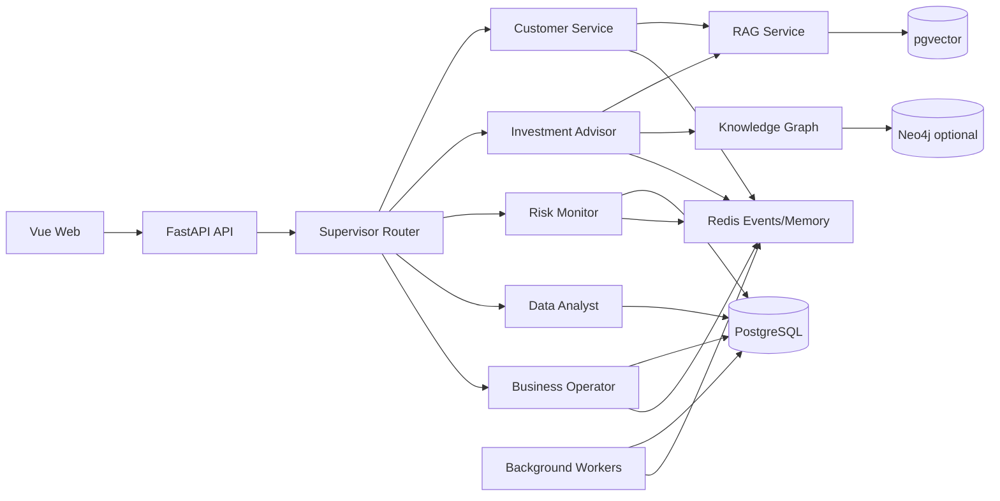

<<<<<<< HEAD
# Intelligent-Financial-Assistant
=======
# 智能财富助手

> 全栈 AI Agent 系统 · 面向财富管理业务 · FastAPI + Vue 3 + LangChain/LangGraph + PostgreSQL/pgvector + Redis + Neo4j

[](https://github.com/cquptcodeer/-Intelligent-Financial-Assistant/actions/workflows/ci.yml)
[](https://www.python.org/)
[](LICENSE)


面向财富管理业务的全栈 AI Agent 系统。项目将客户服务、投资顾问、风险监控、数据分析和业务操作五类能力接入统一 Supervisor 路由，并围绕金融场景实现 RAG、GraphRAG、NL2SQL 安全护栏、客户画像、会话记忆、高风险操作确认和跨 Agent 风控联动。

> 当前定位：面向技术研究与演示的开源项目，不是生产金融系统。线上请求的 Agent 选择以确定性 Supervisor 路由为主；仓库中的 LangGraph 原型目前只有单个 Supervisor 节点，尚未接入自主规划型多 Agent 循环。

**Highlights**

- 🔀 **确定性 Supervisor 路由**：五类领域 Agent 统一接入，客户/员工边界、歧义处理、越权回退全部规则化，20 条路由用例回归
- 🛡️ **NL2SQL 安全护栏**：只读校验、注入拦截（DROP/UPDATE/DELETE/SELECT INTO/FOR UPDATE）、表名白名单、LIMIT 强制封顶
- 🔐 **高风险操作三重护栏**：意图×角色权限矩阵、分层二次确认阈值（零售 1万/5万、私行 10万/50万）、幂等键防重
- 📉 **优雅降级**：Neo4j / 模型 Key 未配置时如实上报 `skipped`，GraphRAG 自动回退纯 RAG，主流程不阻塞
- 📊 **可复现工程**：106 项测试分层（unit/integration/e2e）、100 条确定性离线评测、GitHub Actions CI、Trace ID 全链路可观测

[English](README.en.md) | [演示账号](docs/DEMO_ACCOUNTS.md) | [数据分析 Agent 设计](docs/数据分析Agent需求分析.md) | [功能设计](docs/功能设计文档.html) | [记忆架构](docs/记忆架构设计.html)

## 核心能力

| 模块 | 已实现能力 |
| --- | --- |
| Agent | 客服、投顾、风控、数据分析、业务操作五个领域 Agent；统一执行骨架与角色路由 |
| RAG | PostgreSQL/pgvector 向量检索、知识导入、FAQ/业务文档检索、模型不可用时降级 |
| GraphRAG | Neo4j 产品、客户、持仓和行业关系增强；图数据库不可用时回退纯 RAG |
| 数据分析 | 自然语言意图识别、动态 Schema/Few-shot、只读 SQL 校验、结果缓存与解释 |
| 画像与记忆 | 风险画像、来源置信度、冲突治理、会话归档、标签过期和周期校准 |
| 风控与交易 | 规则扫描、适当性校验、订单/转账/赎回、角色权限、二次确认和幂等 |
| 跨 Agent 联动 | Redis 事件总线连接风控、画像、客服和投顾流程 |
| 工程能力 | FastAPI、异步数据库、统一错误响应、Trace ID、Worker、Vue 管理端和 pytest |

## 系统架构



主要请求流程：

```text
身份认证 -> 角色/权限校验 -> Supervisor 路由 -> 领域 Agent
         -> 规则、RAG、图谱或业务工具 -> 安全护栏/确认 -> 响应与审计沉淀
```

## 技术栈

- Python 3.12、FastAPI、Pydantic、SQLAlchemy Async、Alembic
- LangChain、LangGraph、Qwen/DashScope、OpenAI-compatible API
- PostgreSQL 16、pgvector、Redis 7、Neo4j（可选）
- Vue 3、TypeScript、Vite、Axios
- pytest、Docker Compose

## 快速启动

### 环境要求

- Windows PowerShell 5.1+
- Python 3.12+
- Node.js 20+
- Docker Desktop，支持 `docker compose`

### 一条命令启动

```powershell
powershell -ExecutionPolicy Bypass -File .\scripts\start_dev.ps1
```

脚本会完成以下操作：

1. 缺少 `.env` 时从 `.env.example` 创建；
2. 缺少 `.venv` 时创建 Python 虚拟环境；
3. 安装后端和前端依赖；
4. 启动 PostgreSQL/pgvector 和 Redis；
5. 后台启动 FastAPI、Worker 和 Vue 开发服务器。

默认只启动 PostgreSQL 和 Redis。完整 GraphRAG 演示需要显式启用 Neo4j：

```powershell
powershell -ExecutionPolicy Bypass -File .\scripts\start_dev.ps1 -EnableGraph
```

已安装依赖时可跳过安装：

```powershell
powershell -ExecutionPolicy Bypass -File .\scripts\start_dev.ps1 -SkipInstall
```

服务地址：

- 前端：<http://127.0.0.1:5173>
- API 文档：<http://127.0.0.1:8000/docs>
- 健康检查：<http://127.0.0.1:8000/api/v1/health>
- 开发日志：`logs/dev-*.log`

停止全部开发服务：

```powershell
powershell -ExecutionPolicy Bypass -File .\scripts\stop_dev.ps1
```

只停止应用并保留 PostgreSQL/Redis：

```powershell
powershell -ExecutionPolicy Bypass -File .\scripts\stop_dev.ps1 -KeepInfrastructure
```

### 手动启动

```powershell
Copy-Item .env.example .env
docker compose -f docker-compose.p0.yml up -d --wait
.\.venv\Scripts\python.exe -m uvicorn app.main:app --host 127.0.0.1 --port 8000
```

另开终端启动 Worker 和前端：

```powershell
.\.venv\Scripts\python.exe -m workers.runner
npm run dev --prefix frontend
```

需要 Neo4j 时，手动命令增加 `--profile graph`：

```powershell
$env:NEO4J_ENABLED = "true"
docker compose -f docker-compose.p0.yml --profile graph up -d --wait
```

首次启动空数据库时会自动写入演示账号、客户、产品、交易、画像和知识库数据。`AUTO_SEED=0` 可关闭自动灌入，`AUTO_SEED=1` 可强制执行。

## 模型配置

编辑本地 `.env`：

```dotenv
DASHSCOPE_API_KEY=your-key
QWEN_CHAT_MODEL=qwen-plus
QWEN_EMBEDDING_MODEL=text-embedding-v4
```

`.env` 已被 Git 忽略。没有模型 Key 时，部分 Agent 会使用规则或模板降级，但向量化和模型生成能力不可用。不要提交真实密钥、生产数据库地址或生产 JWT Secret。

## 演示账号

| 角色 | 用户名 | 密码 | 推荐演示 |
| --- | --- | --- | --- |
| 零售投资者 | `retail_investor_demo` | `Demo@2026RetailInvestor` | 风险测评、资产、订单、智能客服 |
| 高净值客户 | `high_net_worth_demo` | `Demo@2026HighNetWorth` | 高净值画像、持仓、智能客服 |
| 理财顾问 | `financial_advisor_demo` | `Demo@2026FinancialAdvisor` | 客户画像、产品推荐、投顾操作 |
| 风控专员 | `risk_specialist_demo` | `Demo@2026RiskSpecialist` | 风险规则、预警、可疑交易 |
| 客户经理 | `customer_manager_demo` | `Demo@2026CustomerManager` | 客户资料、订单、转账、工单 |
| 审计 | `auditor_demo` | `Demo@2026Auditor` | 只读业务数据和审计日志 |
| 系统维护 | `super_admin_demo` | `Demo@2026SuperAdmin` | 用户、权限和回收站 |

完整账号与权限矩阵见 [docs/DEMO_ACCOUNTS.md](docs/DEMO_ACCOUNTS.md)。所有账号仅用于本地开发，生产环境必须设置 `DEMO_ACCOUNTS_ENABLED=false`。

## 推荐演示流程

### 1. 投顾推荐与适当性

使用理财顾问账号，请系统为指定客户推荐产品，展示画像读取、适当性硬门槛、GraphRAG 行业分散度和推荐解释。

### 2. 风控跨 Agent 联动

使用风控专员执行交易扫描，触发预警；再由理财顾问查询同一客户，验证风险标签会暂停或降低高风险产品推荐。

### 3. NL2SQL 安全分析

使用员工账号查询客户数、持仓或交易统计，展示意图分类、只读 SQL 校验、行数限制和自然语言解释。

### 4. 高风险操作确认

使用具备权限的员工发起申购、赎回或转账，展示参数补全、角色权限、一次性确认凭据、取消及防重复执行。

## 测试

测试按依赖分为三层，通过 pytest marker 区分（配置见 `pyproject.toml`）：

| 分层 | marker | 依赖 | 说明 |
| --- | --- | --- | --- |
| 单元测试 | `unit` | 无 | 不访问网络、数据库和 Redis，使用 Mock/Fake |
| 集成测试 | `integration` | PostgreSQL + Redis | 依赖 Docker Compose 启动的基础设施 |
| E2E 冒烟 | `e2e` | 完整 HTTP 服务 | `test_http_*.py` 以脚本方式对真实 API 运行 |

默认执行 `pytest` 会运行全部测试；集成测试在依赖服务不可用时自动跳过，因此无 Docker 环境也能稳定通过。

```powershell
# 单元测试：无需任何外部服务，CI 默认执行
.\.venv\Scripts\python.exe -m pytest -m unit -q

# 集成测试：先启动基础设施
docker compose -f docker-compose.p0.yml up -d --wait
.\.venv\Scripts\python.exe -m pytest -m integration -q

# E2E 冒烟 / 并发 / 故障注入：需先启动完整服务
.\.venv\Scripts\python.exe tests\test_http_smoke.py
.\.venv\Scripts\python.exe tests\test_http_concurrency.py
.\.venv\Scripts\python.exe tests\test_http_faults.py

# 覆盖率报告
.\.venv\Scripts\python.exe -m pytest -m unit --cov=app --cov-report=term-missing
```

CI（GitHub Actions，见 `.github/workflows/ci.yml`）自动执行：Ruff 检查、unit 测试（无 Docker）、PostgreSQL+Redis 服务下的 integration 测试、Agent 离线评测、前端构建。

## Agent 评测

内置确定性离线评测（`eval/`），一条命令生成 JSON + Markdown 报告：

```powershell
.\venv\Scripts\python.exe eval\run_eval.py
```

当前 100 条用例覆盖 Supervisor 路由、RAG/GraphRAG、NL2SQL 安全护栏、权限与高风险操作、故障与降级五个类别；成功率、P50/P95、Token 与成本估算、安全硬门禁（越权拦截/SQL 注入拦截/降级正确性，任一失败整体不合格）全部落在报告中。评测完全离线、确定性、可复现，详见 [eval/README.md](eval/README.md)。

## 项目结构

```text
app/
  agents/          五个领域 Agent、Supervisor 路由和安全护栏
  api/             FastAPI 路由
  services/        画像、记忆、交易、知识库和业务服务
  infrastructure/  模型、Redis、向量库和知识图谱适配器
  models/          SQLAlchemy 模型
frontend/          Vue 管理端与客户/员工工作台
workers/           知识处理、事件转发、画像校准等后台任务
tests/             根项目自动化测试（unit/integration/e2e 分层）
eval/              确定性离线评测：数据集、runner 与报告
eval/reports/      评测报告（JSON + Markdown）
scripts/           启动、数据灌入和同步脚本
docs/              业务知识、账号和 Agent 设计文档
```

## 已知限制

- Supervisor 当前以确定性关键词/规则路由为主，不是自主规划型 Agent Loop；
- Neo4j 为可选依赖，默认 Docker Compose 只启动 PostgreSQL 和 Redis，使用 `--profile graph` 或 `-EnableGraph` 启用；
- 评测报告中的 Token/成本为估算值，基于输入字符数与参考单价；
- 演示数据和规则不能作为真实投资建议；
- 外部模型默认只校验配置，不发起计费请求；设置 `EMBEDDING_SMOKE_CHECK=true` 后健康检查会实际调用一次 Embedding API。

## 安全说明

- `.env`、日志、缓存、构建产物和临时调试文件均被 Git 忽略；
- 示例数据库密码、JWT Secret 和演示账号仅限本地开发；
- 生产环境必须关闭演示账号、轮换全部密钥并使用独立数据库凭据；
- 业务操作受角色权限、适当性规则、二次确认和审计约束。

## License

[MIT](LICENSE)
>>>>>>> 4dfe66e (chore: prepare personal project source)
